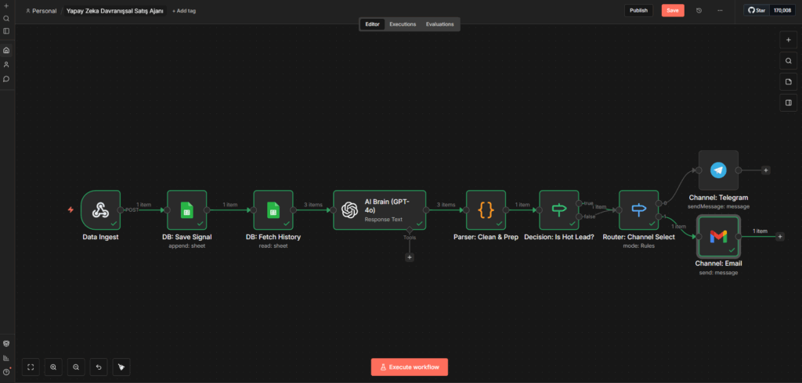

# 🤖 AI Behavioral Sales Agent (Yapay Zeka Davranışsal Satış Ajanı)

> **Müşteri niyetini (Intent) gerçek zamanlı okuyan, analiz eden ve doğru kanaldan satışı kapatan otonom n8n sistemi.**

## 🚨 Problem
E-ticaret sitelerinde ziyaretçilerin büyük çoğunluğu (%98) satın alma işlemini tamamlamadan siteden ayrılır.
* Ziyaretçilerin ayak izlerini (hangi ürüne kaç kere baktı, sepete atıp çıkardı mı) manuel olarak takip etmek imkansızdır.
* Geleneksel pazarlama araçları "bağlamdan kopuk" standart mesajlar attığı için dönüşüm oranları düşüktür.
* Müşterinin o anki **"niyetini" (Intent)** anlamadan yapılan satış baskısı, müşteriyi kaybettirir.

## ✅ Çözüm
Bu otomasyon, bir **"Sanal Satış Temsilcisi"** gibi davranarak:
1.  Kullanıcı hareketlerini **gerçek zamanlı (Real-Time)** izler.
2.  Google Sheets üzerinde dinamik bir **"Müşteri Hafızası"** oluşturur.
3.  **Yapay Zeka (OpenAI)**, müşterinin son 5 hareketini analiz ederek 1 ile 10 arasında bir **"Satın Alma Niyet Skoru"** belirler.
4.  Eğer müşteri **"Sıcak Satış" (Hot Lead)** aşamasındaysa, sistem müşterinin tercih ettiği kanaldan (**Telegram** veya **E-posta**) tamamen kişiye özel ve ikna edici bir teklif sunar.

---

## 🛠 Kullanılan Teknolojiler

| Teknoloji | Görevi |
|-----------|--------|
| **n8n** | Workflow orkestrasyonu, veri yönlendirme ve karar mekanizmaları. |
| **OpenAI (GPT-4o)** | Davranış analizi, niyet puanlama (Lead Scoring) ve dinamik içerik üretimi. |
| **Google Sheets** | Hafıza modülü (Loglama ve Geçmiş Veri Çekme). |
| **JavaScript** | JSON veri temizleme (Parsing), veri birleştirme ve hata yönetimi. |
| **Telegram & Gmail** | Çok kanallı (Omni-channel) iletişim yönetimi. |

---

## ⚙️ Akışın Teknik Detayları (Nasıl Çalışıyor?)

Bu sistem 6 ana aşamadan oluşur:

1.  **Data Ingest (Webhook):** Web sitesinden gelen anlık kullanıcı olayları (örn: `view_item`, `add_to_cart`) JSON formatında yakalanır.
2.  **DB: Memory Module (Google Sheets):** Gelen veri veritabanına işlenir. Ardından, aynı müşteriye ait **son 5 geçmiş hareket** veritabanından geri çağrılır (Context Fetching).
3.  **AI Brain (Analiz):** GPT-4o, müşterinin geçmiş hikayesine bakar (Örn: "3 kez aynı kulaklığa bakmış ama almamış"). Buna göre bir **Niyet Skoru (Purchase Intent Score)** ve mantıksal bir **Gerekçe (Reason)** üretir.
4.  **Data Parser & Logic:** AI'dan gelen ham veri temizlenir, Webhook'tan gelen müşteri kimlik bilgileriyle birleştirilir.
5.  **Decision Engine (Karar):** Eğer Niyet Skoru **7'den büyükse** akış devam eder; düşükse (soğuk müşteri) süreç sonlandırılır.
6.  **Omni-channel Router (Switch):** Müşterinin iletişim tercihine (`email` veya `telegram`) bakılarak trafik ilgili kanala yönlendirilir ve kişiye özel teklif iletilir.

---

## 🚀 Kurulum (Nasıl Kullanılır?)

1.  Bu repodaki `workflow.json` dosyasını indirin.
2.  n8n panelinizde **"Import from File"** seçeneği ile içe aktarın.
3.  Kendi **OpenAI API**, **Google Sheets**, **Telegram** ve **Gmail** bağlantılarınızı (Credentials) ayarlayın.
4.  Webhook URL'ini web sitenize veya test için Postman'e bağlayın.
5.  Sistemi aktif edin!

---

### 👤 Yazar
**Emrah Digital** - *Otomasyon ve Yapay Zeka Çözümleri*
